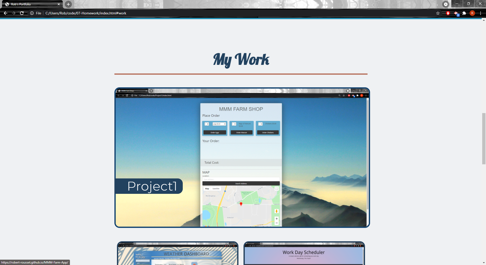

# Portfolio

Welcome to my portfolio. In this portfolio I have presented a brief description about me, 5 of my deployed applications and contact information as well as my updated resume (unfortunately only have previous experience in unrelated jobs). 

Here is a link to my portfolio: https://robert-rousset.github.io/MyPorfolio/

## Screenshots of portfolio

The header of my portfolio: 

About me:

My Work:

Contact:

Phone layout: 

## License
Copyright Robert Rousset, All rights reserved.

Licensed under the MIT license.